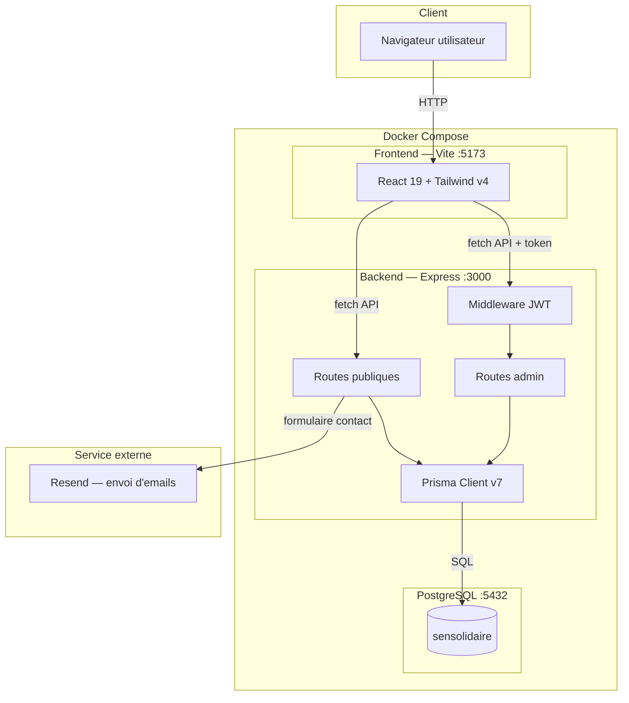
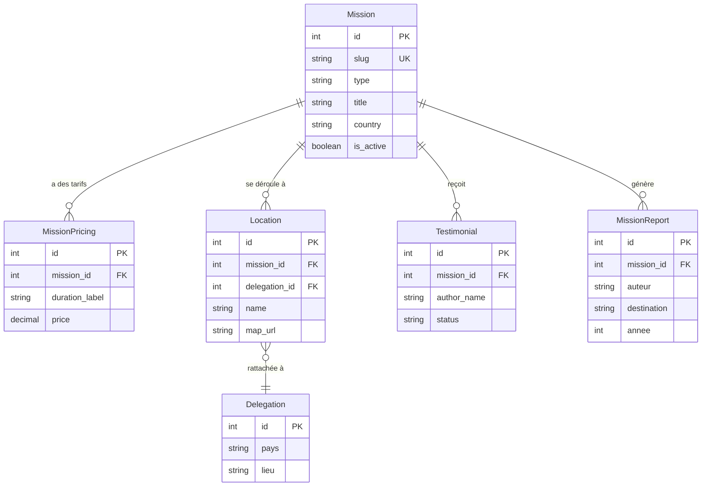
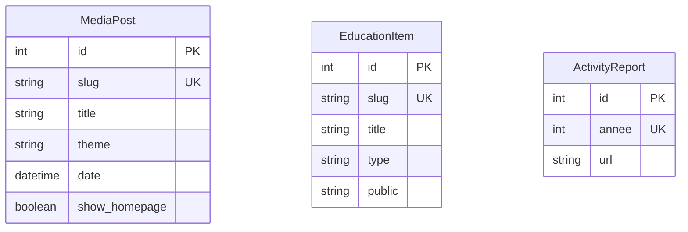
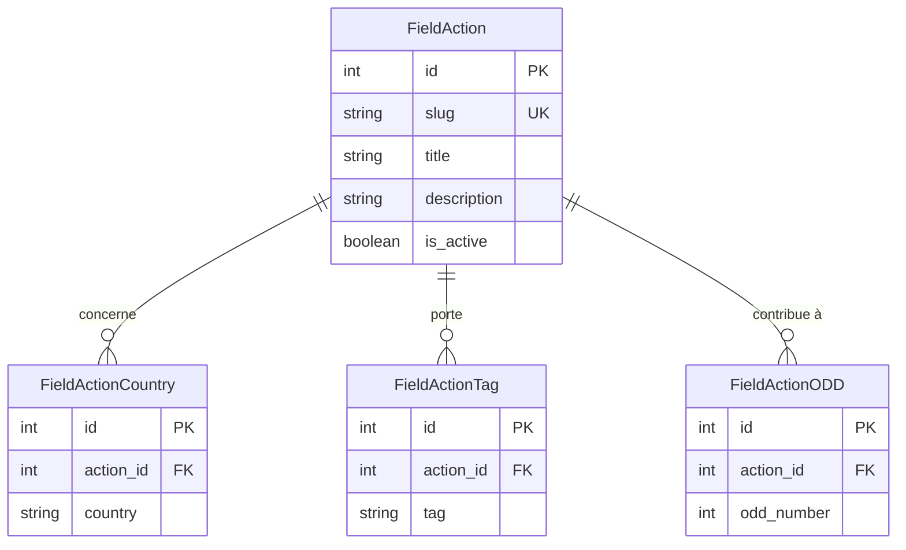
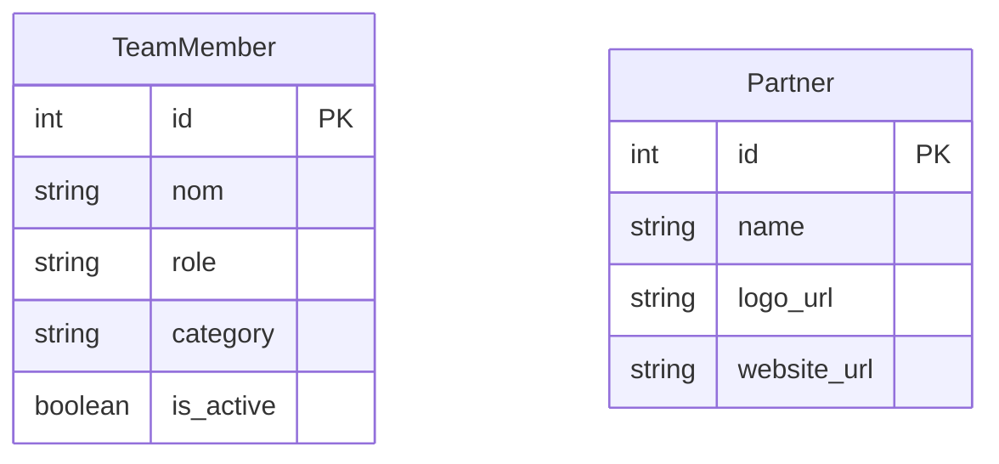
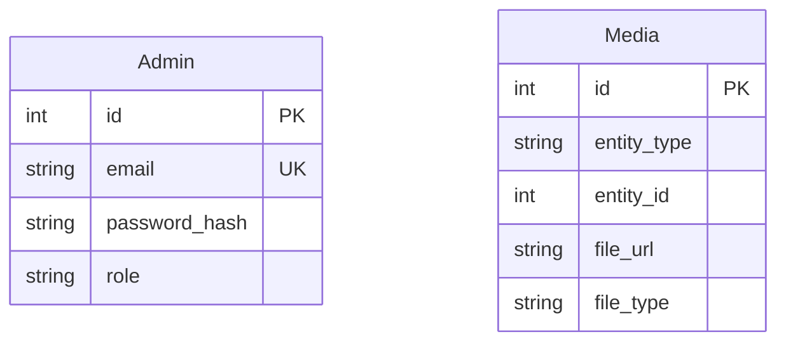

# Sens Solidaires

Refonte complète du site web de **Sens Solidaires**, association humanitaire et environnementale, réalisée dans le cadre d'un projet de fin de formation à Holberton School (Thonon-les-Bains). Le projet couvre le site vitrine public et un dashboard d'administration permettant à l'association de gérer ses contenus en autonomie.

## Sommaire

- [Stack technique](#stack-technique)
- [Architecture](#architecture)
- [Base de données](#base-de-données)
- [Fonctionnalités principales](#fonctionnalités-principales)
- [Installation](#installation)
- [Structure du repo](#structure-du-repo)
- [Tests](#tests)
- [Équipe & rôles](#équipe--rôles)
- [Liens](#liens)

## Stack technique

| Côté | Technologies |
|---|---|
| **Frontend** | React 19 · Vite · Tailwind CSS v4 · React Router v7 · Swiper |
| **Backend** | Node.js · Express · Prisma v7 · PostgreSQL |
| **Authentification** | JWT (access + refresh token) · bcrypt |
| **Emails** | Resend (formulaire de contact) |
| **Infrastructure** | Docker Compose |
| **Tests** | Jest + Supertest (API) · Vitest + React Testing Library (front) · Postman (runbook manuel) |

## Architecture



Le frontend (React) et le backend (Express) sont deux applications indépendantes, chacune dans son propre conteneur Docker, communiquant exclusivement via une **API REST** en JSON.

**Frontend** : une seule application React contient à la fois les pages publiques du site vitrine et le dashboard d'administration. Les routes admin (`/admin/...`) sont protégées côté client et ne s'affichent que si un token JWT valide est présent.

**Backend** : Express expose les routes API, découpées en deux catégories :
- routes **publiques** (missions, témoignages, contact...) accessibles sans authentification
- routes **admin** (CRUD missions, modération...) protégées par un middleware qui vérifie le JWT

**Authentification** : un système à deux tokens — un *access token* de courte durée (transmis dans le header) et un *refresh token* de longue durée (stocké en cookie HTTP-only, inaccessible en JavaScript) pour limiter les risques en cas de vol de token.

**Base de données** : Prisma sert de couche d'accès entre le backend et PostgreSQL — il génère les requêtes SQL et garantit la cohérence du schéma (migrations versionnées).

**Service externe** : Resend gère l'envoi d'emails depuis le formulaire de contact public — aucune donnée sensible n'y transite (pas d'authentification requise).

## Base de données

### Domaine 1 — Missions



**Note d'architecture — FieldAction** : le lien entre une mission et les actions terrain associées (`FieldAction`) se fait par correspondance de pays (`Mission.country` / `FieldActionCountry`), sans relation FK en base. Ce choix est adapté au MVP, où seul le type "Volontariat individuel" est entièrement piloté par la BDD — les types Service Civique, Groupe jeunes et Congé solidaire restent des sections informatives partiellement codées en dur.

**Évolution prévue (V2)** : une fois le CRUD dashboard des actions terrain construit, la cliente pourra associer manuellement une action à une ou plusieurs missions d'un même pays, indépendamment de leur type (ex : un projet de jardin potager commencé par un groupe jeunes au Sénégal, puis poursuivi par des volontaires individuels dans ce même pays). Cela nécessitera une relation many-to-many explicite (`MissionFieldAction`), la card d'impact pouvant alors s'afficher sur plusieurs pages mission simultanément — toutes rattachées au même pays.

**Redondance assumée — MissionReport** : les champs `destination` et `type` de `MissionReport` deviennent redondants avec `mission.country` / `mission.type` lorsque `mission_id` est renseigné. Ce choix est volontaire : `mission_id` est optionnel car un rapport peut exister sans mission liée en base (ex : retour d'expérience déposé par un enseignant sur un projet non fiché comme mission officielle). Les champs texte servent alors de repli pour ne pas perdre l'information dans ce cas.

### Domaine 2 — Contenu éditorial



**Note d'architecture** : ces 3 tables sont indépendantes — aucune relation FK entre elles ni vers `Mission`. Ce sont des contenus éditoriaux autonomes (articles, ateliers pédagogiques, rapports d'activité annuels).

`MediaPost` et `EducationItem` peuvent avoir des médias attachés via la table polymorphique `Media` (voir Domaine 5), mais ce lien ne passe pas par une FK classique et n'est donc pas représenté ici.

**Évolution prévue (V2) — MediaPost** : la cliente pourra publier un article directement rattaché à une mission spécifique (ex : un retour d'expérience terrain publié en actualité, lié à la mission Kenya). Cela nécessitera l'ajout d'une FK optionnelle `mission_id` sur `MediaPost`, suivant le même pattern que `Testimonial` et `MissionReport` — un article pouvant aussi rester indépendant de toute mission (actualités générales de l'association).

### Domaine 3 — Impact terrain



**Note d'architecture** : `FieldActionCountry` remplace un ancien champ `country: string` fragile — une action peut désormais concerner plusieurs pays (ex : projet transfrontalier Sénégal/France). `FieldActionODD` relie une action à un ou plusieurs des 17 Objectifs de Développement Durable de l'ONU.

Aucune relation FK vers `Mission` dans ce domaine — voir la note d'architecture du **Domaine 1 — Missions** pour le lien actuel (par correspondance de pays) et son évolution prévue en V2 (relation many-to-many `MissionFieldAction`).

### Domaine 4 — Communauté



**Note d'architecture** : `TeamMember` et `Partner` sont des tables indépendantes, sans relation FK entre elles ni vers `Mission`/`Delegation`. `TeamMember.category` distingue les membres par rôle dans l'association (direction, bureau, conseil d'administration, autres) — à ne pas confondre avec `Delegation`, qui représente les équipes locales rattachées à un pays et à des missions à l'étranger (voir Domaine 1).

### Domaine 5 — Admin + Médias



**Note d'architecture — Media (polymorphique)** : `Media` ne possède aucune FK Prisma classique. Le champ `entity_type` (ex: `"mission"`, `"education_item"`) combiné à `entity_id` permet de rattacher un fichier à n'importe quelle entité du projet, sans dupliquer la table Media par domaine. Contrepartie assumée : l'intégrité référentielle n'est pas garantie par PostgreSQL/Prisma ici (pas de contrainte FK, pas de cascade automatique) — elle est gérée manuellement côté service (`mediaService.js`).

**Note d'architecture — Admin** : table simple, sans relation. Un seul rôle existe actuellement (`"admin"` par défaut) ; le champ `role` anticipe une éventuelle gestion multi-rôles future (ex: modérateur vs admin complet).

## Fonctionnalités principales

### Site public

- Page d'accueil connectée à l'API (missions, témoignages, actions terrain, partenaires)
- Navbar dynamique — dropdown "Nos missions" connecté à l'API (destinations + "S'engager autrement")
- Page missions (`/missions`) — 4 sections par type, filtres, navigation par ancres
- Page détail mission (`/missions/:slug`) — programme (JSON), tarifs, lieux, témoignages, galerie BDD, infos pratiques en puces
- Page détail lieu (`/lieux/:slug`) — contacts délégation, carte Google Maps, galerie
- Page témoignages — soumission par les visiteurs (RGPD) + affichage des témoignages validés
- Page contact — formulaire + envoi d'email (Resend)
- Page Éducation & sensibilisation — ODD, ateliers, Éco-École, correspondances
- Pages institutionnelles : à propos, équipe, rapports d'activité, soutenir
- Pages légales : mentions, confidentialité, cookies
- Responsive mobile-first (375 / 768 / 1024 / 1440)

> **Interface en français uniquement pour la V1.** La version bilingue français / anglais figurait au périmètre initial : elle est repoussée après la V1, la cliente n'ayant pas encore arbitré entre une traduction rédigée en interne et une traduction automatique. La structure de la base anticipe les deux scénarios.

### Dashboard administrateur

- Authentification sécurisée (JWT access + refresh token)
- CRUD missions complet — formulaire en 9 blocs : informations, visuel, contenu détaillé, programme, tarifs, logistique, comment partir, infos pratiques, galerie photos
- Gestion des tarifs par mission (ajout/modification/suppression dynamique)
- Gestion de la galerie et du PDF par mission
- Modération des témoignages (validation / refus, règle RGPD sur refus → retrait page d'accueil)

## Installation

### Prérequis

- Docker et Docker Compose installés
- Git

### 1. Cloner le repo

```bash
git clone https://github.com/GwenP88/sens-solidaire.git
cd sens-solidaire
```

### 2. Variables d'environnement

Copier le fichier d'exemple et adapter les valeurs (secrets JWT, mot de passe admin) :

```bash
cp backend/.env.example backend/.env
```

### 3. Lancer les conteneurs

```bash
docker-compose up -d --build
```

### 4. Préparer la base de données

```bash
docker-compose exec backend npx prisma migrate deploy
docker-compose exec backend npx prisma generate
docker-compose exec backend node prisma/seed.js
```

### 5. Accéder à l'application

| Service | URL |
|---|---|
| Frontend | http://localhost:5173 |
| Backend API | http://localhost:3000/api/health |
| Prisma Studio | http://localhost:5555 |

### Connexion au dashboard admin

Un compte administrateur est créé automatiquement par le seed :

- **Email** : `admin@sensolidaire.org`
- **Mot de passe** : celui défini dans `ADMIN_PASSWORD` (voir `.env`)

## Structure du repo

```
sens-solidaire/
├── frontend/                  # Application React (Vite)
│   ├── src/
│   │   ├── components/
│   │   │   ├── layout/        # Navbar, Footer, Layout
│   │   │   ├── ui/            # Composants réutilisables (Button, Badge, Carousel...)
│   │   │   ├── admin/         # Composants spécifiques au dashboard
│   │   │   └── testimonials/  # Composants témoignages
│   │   ├── pages/             # Une page par route
│   │   │   └── admin/         # Pages du dashboard
│   │   ├── services/          # api.js — appels HTTP centralisés
│   │   └── utils/             # Constantes partagées (filtres, icônes, footerCta...)
│   ├── tests/                 # Tests Vitest + React Testing Library
│   └── public/images/         # Images statiques, classées par contexte métier
│
├── backend/                   # API Node.js / Express
│   ├── src/
│   │   ├── routes/            # Définition des endpoints
│   │   ├── controllers/       # Validation + formatage réponse
│   │   ├── services/          # Logique métier + accès Prisma
│   │   ├── middlewares/       # authMiddleware (JWT)
│   │   └── config/            # Connexion DB
│   ├── prisma/
│   │   ├── schema.prisma      # Schéma de base de données
│   │   ├── migrations/        # Historique des migrations
│   │   └── seed.js            # Données de test
│   └── tests/                 # Tests Jest + Supertest
│
├── docs/                      # Documentation du projet — voir docs/README.md
│   ├── README.md              # Sommaire de la documentation
│   ├── JDB.md                 # Journal de bord quotidien
│   ├── planning.md            # Sprint planning
│   ├── veille.md              # Journal de veille sécurité
│   ├── modif-en-cours-de-dev.md  # Écarts assumés par rapport aux guides initiaux
│   ├── guide-de-style.md      # Design system
│   └── test_postman_back.md   # Runbook de tests API
│
└── docker-compose.yml         # Orchestration des 3 services
```

## Tests

### Backend — Jest + Supertest

```bash
docker exec sensolidaire_backend npm test
```

**Couverture actuelle** — 3 fichiers, 20 cas au total :

`tests/Missions.admin.test.js` (12 cas) :
- Santé de l'API (`GET /api/health`) et authentification admin
- `POST /api/admin/missions` — création (201) et cas d'erreur : 400 champ manquant, 400 type invalide, 401 sans token, 409 slug déjà pris
- `PATCH /api/admin/missions/:id` — modification partielle (200) et id inexistant (404)
- `DELETE /api/admin/missions/:id` — soft delete (200), ressource devenue inaccessible côté public (404), id inexistant (404)

`tests/Testimonials.admin.test.js` (5 cas) :
- `PATCH /api/admin/testimonials/:id/approve` — jeton valide (200, statut vérifié en base) et id inexistant (404)
- `PATCH /api/admin/testimonials/:id/reject` — sans jeton (401, statut inchangé en base)
- signature JWT altérée (header/payload intacts) → 401, statut inchangé
- mass assignment via le corps de la requête (`{ status: "rejected" }` sur `/approve`) → statut toujours forcé côté serveur

`tests/Upload.security.test.js` (3 cas) — non-régression de la faille d'upload corrigée lors de l'audit sécurité :
- tentative de path traversal via le nom de fichier (`../../../../../src/pwned.js`)
- PDF envoyé sur la route publique (images seulement) → refus, pas un 500
- `POST /api/admin/upload` sans jeton → 401

### Frontend — Vitest + React Testing Library

```bash
docker exec sensolidaire_frontend npm test
```

**Couverture** :

- `LignesToPuces` — fonction utilitaire pure (transformation texte → liste à puces)
- `Button` — composant présentationnel (rendu, `onClick`, état `disabled`)
- `TestimonialForm` — règle métier (bouton d'envoi bloqué sans consentement RGPD)
- `LoginAdmin` — composant avec appel API mocké (connexion réussie → redirection, échec → message d'erreur)

### Tests manuels (Postman)

Un runbook complet est disponible dans [`docs/test_postman_back.md`](./docs/test_postman_back.md), couvrant le démarrage de l'environnement, la préparation de la base de données et les scénarios de test par endpoint.

### Stratégie de test adoptée

| Type | Usage |
|---|---|
| **Jest + Supertest (backend)** | Tests automatisés sur les routes critiques |
| **Vitest + RTL (frontend)** | Fonctions pures, composants, règles métier UI, appels API mockés |
| **Postman (manuel)** | Exploration et validation des nouveaux endpoints avant automatisation |

### Sécurité des dépendances

Audit via `npm audit` (frontend et backend) avant chaque merge sur `dev`.
Dernier audit : **[JJ/MM/2026]** — 0 vulnérabilité connue. Résultats consignés dans [`docs/veille.md`](./docs/veille.md).

## Équipe & rôles

Projet réalisé en binôme dans le cadre de la formation Holberton School (Thonon-les-Bains).

| Rôle | Personne | Périmètre |
|---|---|---|
| **Développement Frontend** | Gwen Pichot (principal) · Alison Amblard (dashboard) | React, Tailwind, design system, intégration API |
| **Développement Backend** | Alison Amblard (principal) · Gwen Pichot (certains items) | Node.js, Express, Prisma, base de données |
| **Conception UX / UI** | Gwen Pichot | Personas, parcours utilisateurs, wireframes et maquettes Figma |
| **Project Manager** | Gwen & Alison | Sprint planning, suivi d'avancement (voir `docs/JDB.md`, `docs/planning.md`) |
| **Source Control Manager (SCM)** | Gwen & Alison | Gestion des branches, revue mutuelle avant merge sur `dev` |
| **Quality Assurance (QA)** | Gwen & Alison | Tests manuels croisés, Postman, Jest, Vitest |

### Répartition front/back

La répartition principale (Gwen → frontend, Alison → backend) n'était pas cloisonnée : chacune a travaillé ponctuellement sur le périmètre de l'autre — Alison sur le front du dashboard admin, Gwen sur certains items backend — dans une logique d'apprentissage mutuel. Ces incursions se faisaient toujours en décalé (une seule personne à la fois sur un même périmètre), afin d'éviter les conflits Git et de garder une attribution claire des tâches.

La conception d'interface (personas, parcours, wireframes, maquettes Figma) a été portée par Gwen ; Alison a intégré les maquettes du dashboard d'administration.

### Méthode de travail

- **Sprints** d'une semaine, détaillés dans `docs/planning.md`
- **Branches** : `main` (production), `dev` (intégration), `dev-front` (Gwen), `dev-back` (Alison)
- **Suivi quotidien** dans `docs/JDB.md` — décisions, bugs, avancement
- **Merge** systématique `dev-front`/`dev-back` → `dev` après chaque groupe de tâches cohérent

## Liens

- **Dépôt GitHub** (public) : [github.com/GwenP88/sens-solidaire](https://github.com/GwenP88/sens-solidaire)
- **Sommaire de la documentation** : [`docs/README.md`](./docs/README.md)
- **Journal de bord** : [`docs/JDB.md`](./docs/JDB.md)
- **Journal de veille sécurité** : [`docs/veille.md`](./docs/veille.md)
- **Sprint planning** : [`docs/planning.md`](./docs/planning.md)
- **Design system** : [`docs/guide-de-style.md`](./docs/guide-de-style.md)
- **Runbook de tests API** : [`docs/test_postman_back.md`](./docs/test_postman_back.md)

> **Environnement de production** : non déployé à ce stade — le déploiement est planifié en Phase 3 (septembre 2026), voir `docs/planning.md`.
